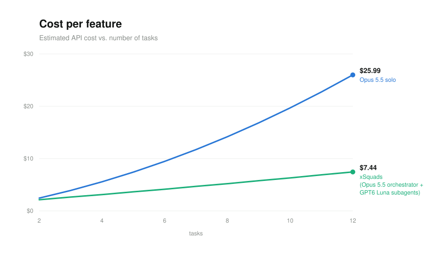

# xSquad (xSquad-code)

**Delegate your work to a squad of agents — and get back proof it actually works.**

Give xSquad a high-level goal. One **orchestrator** agent plans it, writes self-contained
task briefs, and fans the work out to parallel **implementer subagents** (Claude Code, Pi,
or Codex). Nothing is reported done until it's proven:

- **Claimed output earns nothing** — the orchestrator re-runs project **validators**
  (build/test/lint plus feature validators that drive the real app) after every task.
- **Validators never rot** — behavior changes update the validator suite before a task
  counts as green.
- **Thermo-nuclear review built in** — two independent reviewers (security/correctness,
  code quality) audit the whole diff; their findings go back to the squad as fix briefs
  and are re-verified until clean.
- **The squad learns** — durable lessons persist across runs in `.xsquad/MEMORY.md`.
- **Cheap triage and checks** — a System One pre-pass on
  [Jev](https://docs.typesafe.ai) (TypeSafe AI, ~200 ms per call) buckets validator
  failures and review findings, and checks subagent reports and logs against the brief's
  acceptance criteria, so agents read only what needs judgment instead of raw output.
  Use a `TYPESAFE_API_KEY`, Vercel AI Gateway (`AI_GATEWAY_API_KEY`, model
  `typesafe-ai/jev`), or the keyless [classifier.dev](https://classifier.dev) proxy —
  `/xSq-setup` asks which.

Six installable skills: the core orchestrator plus five standalone slash commands.

## Token cost: solo Opus 5.5 vs. xSquad



These are modeled estimates, not measurements. The xSquad orchestrator runs on Opus 5.5 and
the implementer and reviewer subagents run on GPT-6 Luna ($0.10 / $0.50 per 1M input / output
tokens, with no cache discount assumed). On a 6-task feature, the estimate is about $4.13
with xSquad vs. $9.46 solo. On a 12-task feature, it's about $7.44 vs. $25.99.

## Install

```sh
npx skills add https://github.com/areai51/xsquad         # skills.sh — installs all six skills
```


## Quickstart

1. `/xSq-setup` — pick runner (claude / pi / codex), models per role, and the Jev backend → `.xsquad/config.json` (keys go to the gitignored `.env`); if no validator suite exists yet, it automatically chains the validator setup in the same pass
2. `/xsquad build the export-to-CSV feature end to end` — plan → briefs → parallel subagents → continuous validator verification → automatic review → fix loop → report

## Commands

| Command | What it does |
|---|---|
| `/xsquad <goal>` | Full squad run: plan → briefs → parallel subagents → validator verification → automatic code review → fix loop → report |
| `/xSq-setup` | Configure runner + models per role; chains validator setup when no suite exists |
| `/xSq-validator-setup` | Generate the project validator suite |
| `/xSq-validator-run` | Run validators, triage failures (product bug / validator drift / env blocker) |
| `/xSq-validator-update` | Upkeep pass keeping validators honest (full pass + mid-run variant) |
| `/xSq-code-review` | Thermo-nuclear review; findings fixed by the squad |

## Layout

```
<this-repo>/
└── skills/
    ├── xsquad/            # core skill: workflow + command router
    │   ├── SKILL.md
    │   ├── commands/      # the five command procedures
    │   ├── agents/        # subagent contracts (implementer, two reviewers)
    │   ├── references/    # config schema, dispatch commands, brief/report templates
    │   └── scripts/       # classify.sh / classify.py — Jev triage + check pre-pass
    └── xsq-*/SKILL.md     # the five command wrappers
```

In a project the squad works on, everything persists under `.xsquad/`: `config.json` and
`MEMORY.md` (committed), `validators/` (committed), and `runs/<run-id>/` — briefs,
reports, logs, evidence, review artifacts (gitignored).
